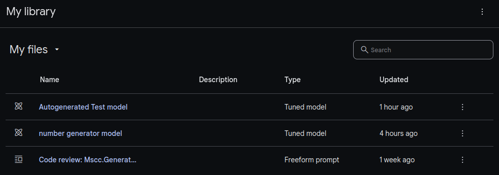

# Gemini AI Client for .NET and ASP.NET Core
[](https://github.com/mscraftsman/generative-ai/blob/main/LICENSE)

[](https://github.com/mscraftsman/generative-ai/actions/workflows/dotnetcore.yml)
[](https://github.com/mscraftsman/generative-ai/stargazers)

Access and integrate the Gemini API into your .NET applications. The packages support both Google AI Studio and Google Cloud Vertex AI.

| Name                                            | Package                                                                              | Status                                                                                                                                                                                                                                                                        |
|-------------------------------------------------|--------------------------------------------------------------------------------------|-------------------------------------------------------------------------------------------------------------------------------------------------------------------------------------------------------------------------------------------------------------------------------|
| Client for .NET                                 | [Mscc.GenerativeAI](https://www.nuget.org/packages/Mscc.GenerativeAI/)               | [](https://www.nuget.org/packages/Mscc.GenerativeAI/)[](https://www.nuget.org/packages/Mscc.GenerativeAI/)                             |
| Client for ASP.NET (Core)                       | [Mscc.GenerativeAI.Web](https://www.nuget.org/packages/Mscc.GenerativeAI.Web/)       | [](https://www.nuget.org/packages/Mscc.GenerativeAI.Web/)[](https://www.nuget.org/packages/Mscc.GenerativeAI.Web/)             |
| Client for .NET using Google API Client Library | [Mscc.GenerativeAI.Google](https://www.nuget.org/packages/Mscc.GenerativeAI.Google/) | [](https://www.nuget.org/packages/Mscc.GenerativeAI.Google/)[](https://www.nuget.org/packages/Mscc.GenerativeAI.Google/) |

Read more about [Mscc.GenerativeAI.Web](./src/Mscc.GenerativeAI.Web) and how to add it to your ASP.NET (Core) web applications.
Read more about [Mscc.GenerativeAI.Google](./src/Mscc.GenerativeAI.Google).

## Install the package 🖥️

Install the package [Mscc.GenerativeAI](https://www.nuget.org/packages/Mscc.GenerativeAI/) from NuGet. You can install the package from the command line using either the command line or the NuGet Package Manager Console. Or you add it directly to your .NET project.

Add the package using the `dotnet` command line tool in your .NET project folder.

```text
> dotnet add package Mscc.GenerativeAI
```

Working with Visual Studio use the NuGet Package Manager to install the package Mscc.GenerativeAI.

```text
PM> Install-Package Mscc.GenerativeAI
```

Alternatively, add the following line to your `.csproj` file.

```text
  <ItemGroup>
    <PackageReference Include="Mscc.GenerativeAI" Version="1.5.0" />
  </ItemGroup>
```

You can then add this code to your sources whenever you need to access any Gemini API provided by Google. This package works for Google AI (Google AI Studio) and Google Cloud Vertex AI.

## Features (as per Gemini analysis) ✦

The provided code defines a C# library for interacting with Google's Generative AI models, specifically the Gemini models. It provides functionalities to:

- **List available models**: This allows users to see which models are available for use.
- **Get information about a specific model**: This provides details about a specific model, such as its capabilities and limitations.
- **Generate content**: This allows users to send prompts to a model and receive generated text in response. 
- **Generate content stream**: This allows users to receive a stream of generated text from a model, which can be useful for real-time applications. 
- **Generate a grounded answer**: This allows users to ask questions and receive answers that are grounded in provided context. 
- **Generate embeddings**: This allows users to convert text into numerical representations that can be used for tasks like similarity search. 
- **Count tokens**: This allows users to estimate the cost of using a model by counting the number of tokens in a prompt or response. 
- **Start a chat session**: This allows users to have a back-and-forth conversation with a model.
- **Create tuned models**: This allows users to provide samples for tuning an existing model. Currently, only the `text-bison-001` and `gemini-1.0-pro-001` models are supported for tuning
- **File API**: This allows users to upload large files and use them with Gemini 1.5.

The package also defines various helper classes and enums to represent different aspects of the Gemini API, such as model names, request parameters, and response data.

## Authentication use cases 👥

The package supports the following use cases to authenticate.

| API       | Authentication                                                                                                                              | Remarks                                                          |
|-----------|---------------------------------------------------------------------------------------------------------------------------------------------|------------------------------------------------------------------|
| Google AI | [Authentication with an API key](https://ai.google.dev/tutorials/setup)                                                                     |                                                                  |
| Google AI | [Authentication with OAuth](https://ai.google.dev/docs/oauth_quickstart)                                                                    | required for tuned models                                        |
| Vertex AI | [Authentication with Application Default Credentials (ADC)](https://cloud.google.com/docs/authentication/provide-credentials-adc#local-dev) |                                                                  |
| Vertex AI | [Authentication with Credentials by Metadata Server](https://cloud.google.com/docs/authentication/rest#metadata-server)                     | requires access to a metadata server                             |
| Vertex AI | [Authentication with OAuth]()                                                                                                               | using [Mscc.GenerativeAI.Google](./src/Mscc.GenerativeAI.Google) |
| Vertex AI | [Authentication with Service Account](https://cloud.google.com/docs/authentication/provide-credentials-adc#service-account)                 | using [Mscc.GenerativeAI.Google](./src/Mscc.GenerativeAI.Google) |

This applies mainly to the instantiation procedure.

## Getting Started 🚀

Use of Gemini API in either Google AI or Vertex AI is almost identical. The major difference is the way to instantiate the model handling your prompt.

### Using Environment variables

In the cloud most settings are configured via environment variables (EnvVars). The ease of configuration, their wide spread support and the simplicity of environment variables makes them a very interesting option.

| Variable Name                  | Description                                                   |
|--------------------------------|---------------------------------------------------------------|
| GOOGLE_AI_MODEL                | The name of the model to use (default is *Model.Gemini10Pro*) |
| GOOGLE_API_KEY                 | The API key generated in Google AI Studio                     |
| GOOGLE_PROJECT_ID              | Project ID in Google Cloud to access the APIs                 |
| GOOGLE_REGION                  | Region in Google Cloud (default is *us-central1*)             |
| GOOGLE_ACCESS_TOKEN            | The access token required to use models running in Vertex AI  |
| GOOGLE_APPLICATION_CREDENTIALS | Path to the application credentials file.                     |
| GOOGLE_WEB_CREDENTIALS         | Path to a Web credentials file.                               |

Using any environment variable provides a simplified access to a model.

```csharp
using Mscc.GenerativeAI;

var model = new GenerativeModel();
```

### Choose an API and authentication mode

Google AI with an API key

```csharp
using Mscc.GenerativeAI;
// Google AI with an API key
var googleAI = new GoogleAI(apiKey: "your API key");
var model = googleAI.GenerativeModel(model: Model.GeminiPro);

// Original approach, still valid.
// var model = new GenerativeModel(apiKey: "your API key", model: Model.GeminiPro);
```

Google AI with OAuth. Use `gcloud auth application-default print-access-token` to get the access token.

```csharp
using Mscc.GenerativeAI;
// Google AI with OAuth. Use `gcloud auth application-default print-access-token` to get the access token.
var model = new GenerativeModel(model: Model.GeminiPro);
model.AccessToken = accessToken;
```

Vertex AI with OAuth. Use `gcloud auth application-default print-access-token` to get the access token.

```csharp
using Mscc.GenerativeAI;
// Vertex AI with OAuth. Use `gcloud auth application-default print-access-token` to get the access token.
var vertex = new VertexAI(projectId: projectId, region: region);
var model = vertex.GenerativeModel(model: Model.Gemini10Pro);
model.AccessToken = accessToken;
```

The `ConfigurationFixture` type in the test project implements multiple options to retrieve sensitive information, ie. API key or access token.

### Using Google AI Gemini API

Working with Google AI in your application requires an API key. Get an API key from [Google AI Studio](https://aistudio.google.com/app/apikey).

```csharp
using Mscc.GenerativeAI;

var apiKey = "your_api_key";
var prompt = "Write a story about a magic backpack.";

var model = new GenerativeModel(apiKey: apiKey, model: Model.GeminiPro);

var response = model.GenerateContent(prompt).Result;
Console.WriteLine(response.Text);
```

### Using Vertex AI Gemini API

Use of [Vertex AI](https://console.cloud.google.com/vertex-ai) requires an account on [Google Cloud](https://console.cloud.google.com/), a project with billing and Vertex AI API enabled.

```csharp
using Mscc.GenerativeAI;

var projectId = "your_google_project_id"; // the ID of a project, not its name.
var region = "us-central1";     // see documentation for available regions.
var accessToken = "your_access_token";      // use `gcloud auth application-default print-access-token` to get it.
var prompt = "Write a story about a magic backpack.";

var vertex = new VertexAI(projectId: projectId, region: region);
var model = vertex.GenerativeModel(model: Model.GeminiPro);
model.AccessToken = accessToken;

var response = model.GenerateContent(prompt).Result;
Console.WriteLine(response.Text);
```

## More examples 🪄

Supported models are accessible via the `Model` class. Since release 0.9.0 there is support for the previous PaLM 2 models and their functionalities.

### Text-and-image input

```csharp
using Mscc.GenerativeAI;

var apiKey = "your_api_key";
var prompt = "Parse the time and city from the airport board shown in this image into a list, in Markdown";
var model = new GenerativeModel(apiKey: apiKey, model: Model.GeminiVisionPro);
var request = new GenerateContentRequest(prompt);
await request.AddMedia("https://ai.google.dev/static/docs/images/timetable.png");

var response = await model.GenerateContent(request);
Console.WriteLine(response.Text);
```

The part of `InlineData` is supported by both Google AI and Vertex AI. Whereas the part `FileData` is restricted to Vertex AI only.

### Chat conversations

Gemini enables you to have freeform conversations across multiple turns. You can interact with Gemini Pro using a single-turn prompt and response or chat with it in a multi-turn, continuous conversation, even for code understanding and generation.

```csharp
using Mscc.GenerativeAI;

var apiKey = "your_api_key";
var model = new GenerativeModel(apiKey: apiKey);    // using default model: gemini-pro
var chat = model.StartChat();

// Instead of discarding you could also use the response and access `response.Text`.
_ = await chat.SendMessage("Hello, fancy brainstorming about IT?");
_ = await chat.SendMessage("In one sentence, explain how a computer works to a young child.");
_ = await chat.SendMessage("Okay, how about a more detailed explanation to a high schooler?");
_ = await chat.SendMessage("Lastly, give a thorough definition for a CS graduate.");

// A chat session keeps every response in its history.
chat.History.ForEach(c => Console.WriteLine($"{c.Role}: {c.Text}"));

// Last request/response pair can be removed from the history.
var latest = chat.Rewind();
Console.WriteLine($"{latest.Sent} - {latest.Received}");
```

### Use Gemini 1.5 with large files

With Gemini 1.5 you can create multimodal prompts supporting large files.

The following example uploads one or more files via File API and the created File URIs are used in the `GenerateContent` call to generate text.

```csharp
using Mscc.GenerativeAI;

var apiKey = "your_api_key";
var prompt = "Make a short story from the media resources. The media resources are:";
IGenerativeAI genAi = new GoogleAI(apiKey);
var model = genAi.GenerativeModel(Model.Gemini15Pro);

// Upload your large image(s).
// Instead of discarding you could also use the response and access `response.Text`.
var filePath = Path.Combine(Environment.CurrentDirectory, "verylarge.png");
var displayName = "My very large image";
_ = await model.UploadMedia(filePath, displayName);

// Create the prompt with references to File API resources.
var request = new GenerateContentRequest(prompt);
var files = await model.ListFiles();
foreach (var file in files.Where(x => x.MimeType.StartsWith("image/")))
{
    _output.WriteLine($"File: {file.Name}");
    request.AddMedia(file);
}
var response = await model.GenerateContent(request);
Console.WriteLine(response.Text);
```

Read more about [Gemini 1.5: Our next-generation model, now available for Private Preview in Google AI Studio](https://developers.googleblog.com/2024/02/gemini-15-available-for-private-preview-in-google-ai-studio.html).

### Create a tuned model

The Gemini API lets you tune models on your own data. Since it's your data and your tuned models this needs stricter access controls than API-Keys can provide.

Before you can create a tuned model, you'll need to [setup OAuth for your project](https://ai.google.dev/palm_docs/oauth_quickstart).

```csharp
using Mscc.GenerativeAI;

var projectId = "your_google_project_id"; // the ID of a project, not its name.
var accessToken = "your_access_token";      // use `gcloud auth application-default print-access-token` to get it.
var model = new GenerativeModel(apiKey: null, model: Model.Gemini10Pro001)
{
    AccessToken = accessToken, ProjectId = projectId
};
var parameters = new HyperParameters() { BatchSize = 2, LearningRate = 0.001f, EpochCount = 3 };
var dataset = new List<TuningExample>
{    
    new() { TextInput = "1", Output = "2" },
    new() { TextInput = "3", Output = "4" },
    new() { TextInput = "-3", Output = "-2" },
    new() { TextInput = "twenty two", Output = "twenty three" },
    new() { TextInput = "two hundred", Output = "two hundred one" },
    new() { TextInput = "ninety nine", Output = "one hundred" },
    new() { TextInput = "8", Output = "9" },
    new() { TextInput = "-98", Output = "-97" },
    new() { TextInput = "1,000", Output = "1,001" },
    new() { TextInput = "thirteen", Output = "fourteen" },
    new() { TextInput = "seven", Output = "eight" },
};
var request = new CreateTunedModelRequest(Model.Gemini10Pro001, 
    "Simply autogenerated Test model",
    dataset,
    parameters);

var response = await model.CreateTunedModel(request);
Console.WriteLine($"Name: {response.Name}");
Console.WriteLine($"Model: {response.Metadata.TunedModel} (Steps: {response.Metadata.TotalSteps})");
```
(This is still work in progress but operational. Future release will provide types to simplify the create request.)

Tuned models appear in your Google AI Studio library.

[](https://aistudio.google.com/app/library)

Read more about [Tune Gemini Pro in Google AI Studio or with the Gemini API](https://developers.googleblog.com/2024/03/tune-gemini-pro-in-google-ai-studio-or-gemini-api.html).

### More samples

The folders [samples](./samples) and [tests](./tests) contain more examples.

- [Simple console application](./samples/Console.Minimal.Prompt)
- [ASP.NET Core Minimal web application](./samples/Web.Minimal.Api)
- [ASP.NET Core MVP web application](./samples/Web.Mvc) (work in progress!)

## Troubleshooting ⚡

Sometimes you might have authentication warnings **HTTP 403** (Forbidden). Especially while working with OAuth-based authentication. You can fix it by re-authenticating through ADC.

```bash
gcloud config set project "$PROJECT_ID"

gcloud auth application-default set-quota-project "$PROJECT_ID"
gcloud auth application-default login
```

Make sure that the required API have been enabled.

```bash
# ENABLE APIs
gcloud services enable aiplatform.googleapis.com
```

In case of long-running streaming requests it can happen that you get a `HttpIOException`: The response ended prematurely while waiting for the next frame from the server. (ResponseEnded). 
The root cause is the .NET runtime and the solution is to **upgrade to the latest version of the .NET runtime**. 
In case that you cannot upgrade you might disable dynamic window sizing as a workaround:
Either using the environment variable [`DOTNET_SYSTEM_NET_HTTP_SOCKETSHTTPHANDLER_HTTP2FLOWCONTROL_DISABLEDYNAMICWINDOWSIZING`](https://docs.microsoft.com/en-us/dotnet/core/tools/dotnet-environment-variables)
```bash
DOTNET_SYSTEM_NET_HTTP_SOCKETSHTTPHANDLER_HTTP2FLOWCONTROL_DISABLEDYNAMICWINDOWSIZING=true
```
or setting an `AppContext` switch:
```csharp
AppContext.SetSwitch("System.Net.SocketsHttpHandler.Http2FlowControl.DisableDynamicWindowSizing", true);
```

Several issues regarding this problem have been reported on GitHub:
- https://github.com/dotnet/runtime/pull/97881
- https://github.com/grpc/grpc-dotnet/issues/2361
- https://github.com/grpc/grpc-dotnet/issues/2358

## Using the tests 🧩

The repository contains a number of test cases for Google AI and Vertex AI. You will find them in the [tests](./tests) folder. They are part of the [GenerativeAI solution].
To run the tests, either enter the relevant information into the [appsettings.json](./tests/Mscc.GenerativeAI/appsettings.json), create a new `appsettings.user.json` file with the same JSON structure in the `tests` folder, or define the following environment variables

- GOOGLE_API_KEY
- GOOGLE_PROJECT_ID
- GOOGLE_REGION
- GOOGLE_ACCESS_TOKEN (optional: if absent, `gcloud auth application-default print-access-token` is executed)

The test cases should provide more insights and use cases on how to use the [Mscc.GenerativeAI](https://github.com/mscraftsman/generative-ai) package in your .NET projects.

## Feedback ✨

For support and feedback kindly create issues at the <https://github.com/mscraftsman/generative-ai> repository.

## License 📜

This project is licensed under the [Apache-2.0 License](LICENSE) - see the [LICENSE](LICENSE) file for details.

## Citation 📚

If you use [Mscc.GenerativeAI](https://github.com/mscraftsman/generative-ai) in your research project, kindly cite as follows

```text
@misc{Mscc.GenerativeAI,
  author = {Kirstätter, J and MSCraftsman},
  title = {Mscc.GenerativeAI - Gemini AI Client for .NET and ASP.NET Core},
  year = {2024},
  publisher = {GitHub},
  journal = {GitHub repository},
  note = {https://github.com/mscraftsman/generative-ai}
}
```

--- 

Created by [Jochen Kirstätter](https://jochen.kirstaetter.name/).
